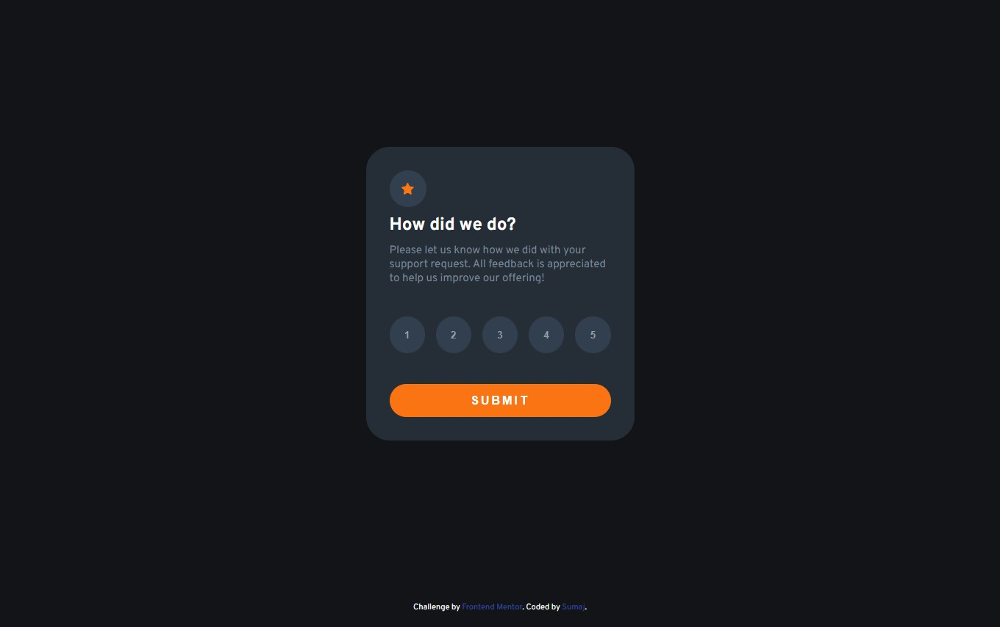

# Frontend Mentor - Interactive rating component solution

This is a solution to the [Interactive rating component challenge on Frontend Mentor](https://www.frontendmentor.io/challenges/interactive-rating-component-koxpeBUmI). Frontend Mentor challenges help you improve your coding skills by building realistic projects. 

## Table of contents

  - [The challenge](#the-challenge)
  - [Screenshot](#screenshot)
  - [Links](#links)
  - [Built with](#built-with)
  - [What I learned](#what-i-learned)
  - [Useful resources](#useful-resources)
  - [Author](#author)


## Overview

### The challenge

Users should be able to:

- View the optimal layout for the app depending on their device's screen size
- See hover states for all interactive elements on the page
- Select and submit a number rating
- See the "Thank you" card state after submitting a rating

### Screenshot




### Links

- Solution URL: [Add solution URL here](https://www.frontendmentor.io/solutions/interactive-rating-component-oVSK0eb0kw)
- Live Site URL: [Add live site URL here](https://imaginative-sherbet-cc309f.netlify.app/)

## My process

### Built with

- Semantic HTML5 markup
- CSS custom properties
- Flexbox
- CSS Grid


### What I learned

En HTML aprendí que el script defer src sirve para que se ejecute el dom sin que el script lo interrumpa.

En CSS que con display: grid y place-items:center puedo centrar un elemento fácilmente.

```html
<script defer src="script.js"></script>
</head>
```
```css
body {
  display: grid;
  place-items: center;
}
```


### Useful resources

- [Example resource 1](https://es.javascript.info/script-async-defer) - Me ayudo a entender el atributo defer en script.


## Author

- Website - [Sumajestad44](https://github.com/sumajestad44)
- Frontend Mentor - [@sumajestad44](https://www.frontendmentor.io/profile/sumajestad44)


